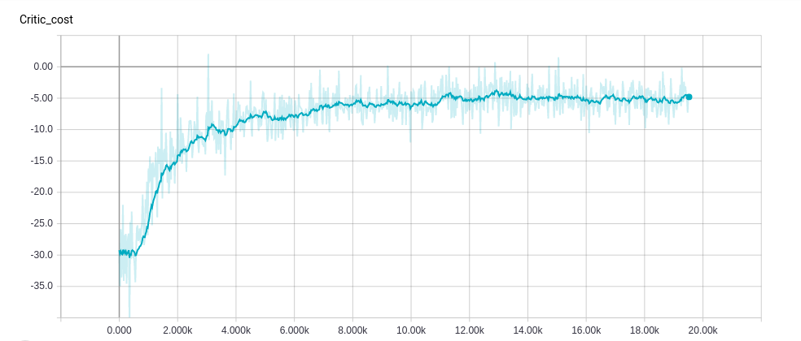
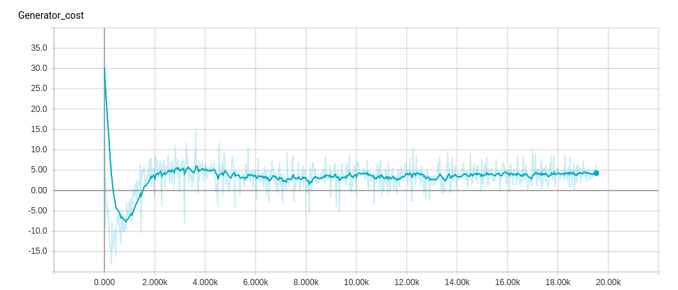

# Improved training of Wasserstein GANs	

---

In this project, the paper [Improved training of Wasserstein GANs](https://arxiv.org/abs/1704.00028) was implemented in Tensorflow and Python 3.6.

The paper is the improvement of the [Wasserstein GAN](https://arxiv.org/abs/1701.07875) paper, which again is the improvement over the original [Generative Adversarial Network](https://arxiv.org/abs/1406.2661) paper.

Each of those extension papers represents a step to a more stable training regime.

Improved WGAN, compared to GAN:

* Uses a different distance measure to compare distributions (Wasserstein instead of KL-divergence)
* Enforces the Lipschitz constraint on the critic using gradient penalty

The images on the top are some of the best results with DCGAN and custom upsampling architecture. 
The dataset used was [Labeled Faces in the Wild](http://vis-www.cs.umass.edu/lfw/), the deep-funneled version.

Sample critic and generator training provided below:

This project was created as a part of the FER course Analysis of massive data sets.

